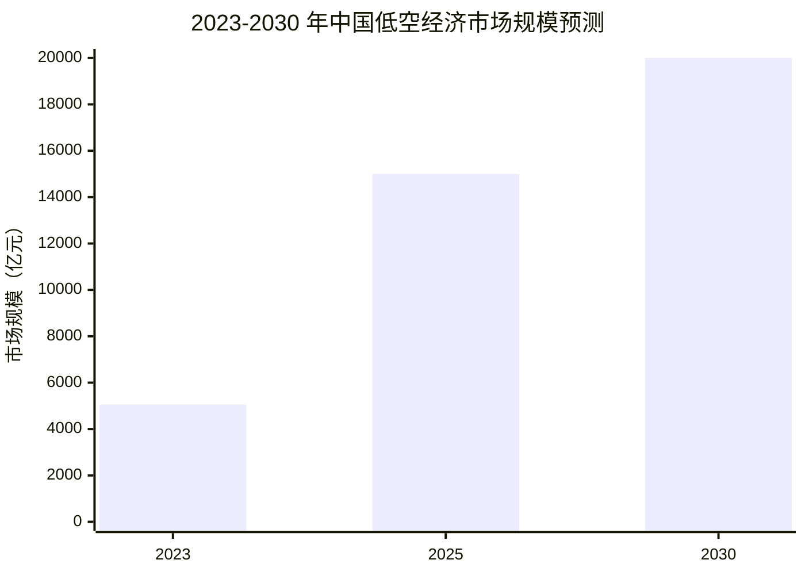
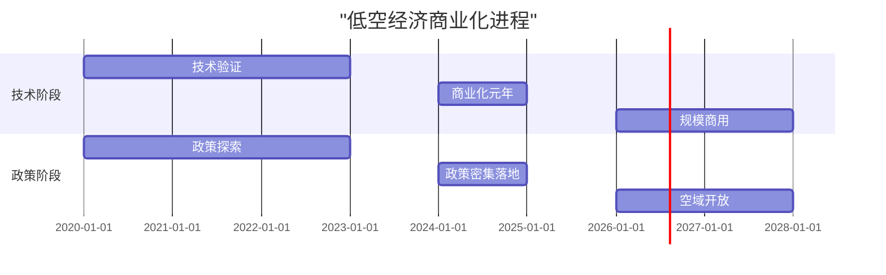
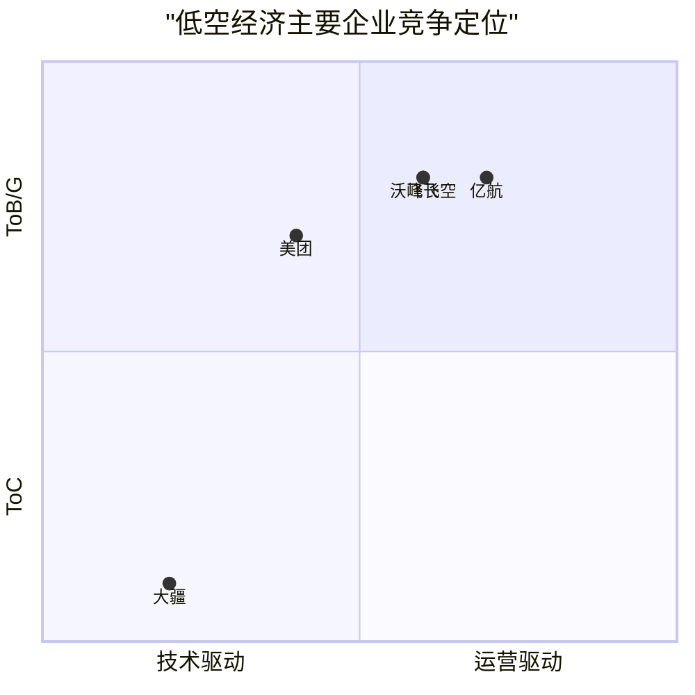
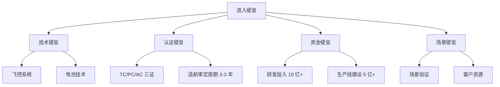
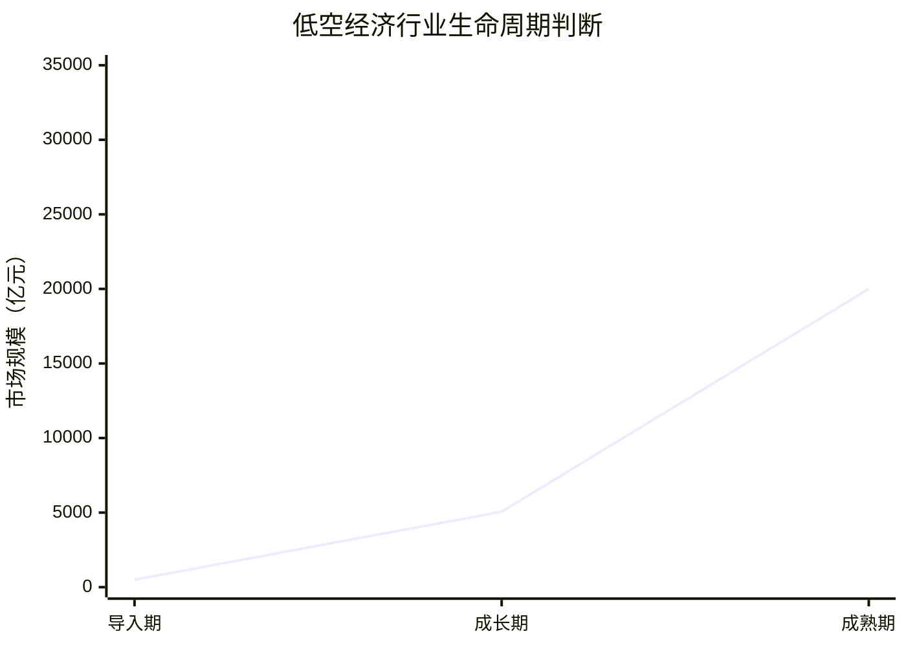

# 中国低空经济行业研究报告

**报告日期**：2026 年 4 月  
**数据来源**：政府网、民航局、发改委等 15 个权威来源  
**数据可靠性**：高可靠性来源 8 条，中高可靠性 6 条，中可靠性 10 条

---

## 一、执行摘要

### 核心结论

2023 年中国低空经济市场规模 5059.5 亿元（增速 33.8%，赛迪顾问/新华网），2025 年预测达 1.5 万亿元（民航局）。2024 年 3 月低空经济首次写入政府工作报告，定位为"新增长引擎"；2024 年 12 月发改委设立低空经济发展司。行业呈现三大特征：

1. **高速增长期**：2025 年市场规模预测 1.5 万亿元（民航局），较 2023 年增长近 2 倍
2. **政策密集落地**：从中央到地方形成完整政策体系，2024-2028 年为政策红利窗口期（政府网/发改委/券商研报）
3. **商业化破冰**：亿航智能 2024 年交付增长超 300%（国泰君安研报/腾讯新闻），美团无人机累计订单超 10 万单（腾讯研究院/界面新闻）

### 关键数据速览

| 指标 | 2023 年 | 2025 年预测 | 2030 年预测 |
|------|--------|------------|------------|
| 市场规模 | 5059.5 亿元 | 1.5 万亿元 | 2 万亿元 |
| 同比增长 | 33.8% | - | - |
| 政策里程碑 | - | - | - |

*数据来源：2023 年 - 赛迪顾问/新华网（高可靠性）；2025/2030 年 - 中国民航局（高可靠性）*

*注：2024 年市场规模数据存在较大口径差异（中商产业研究院估算 6700-9700 亿元 vs 艾媒咨询估算 4807 亿元），差异源于"全产业链"与"核心市场"的不同统计范围，本报告不采用 2024 年数据作为趋势判断依据*

### 主要机会与风险

| 机会 | 风险 |
|------|------|
| 政策窗口期：2024-2028 年规模商用前为布局黄金期（政府网/券商研报） | 空域管理限制：低空空域开放程度仍有限 |
| 应用场景拓展：物流配送千亿级、载人交通万亿级（腾讯研究院/民航局） | 商业化落地难度：eVTOL 单机成本 200-300 万元（公司公告/行业媒体） |
| 技术迭代：电池能量密度从 250-300Wh/kg 向 400Wh/kg+ 突破（保时捷咨询） | 2028 年前行业整合：50%+ 企业可能淘汰（行业研报估算） |

### 战略建议摘要

- **企业方**：聚焦已验证场景（物流/巡检），2026 年前完成商业化闭环（腾讯研究院/国泰君安研报）
- **投资方**：关注 eVTOL 整机、飞控系统、电池技术三大核心环节（保时捷咨询/行业研报）
- **政策方**：加速低空空域分类管理，平衡安全与发展（发改委/民航局）

---

## 二、市场概况

### 2.1 市场规模与增长

#### 市场规模走势

2023 年中国低空经济市场规模达**5059.5 亿元**，同比增长**33.8%**（赛迪顾问《中国低空经济发展研究报告（2024）》/新华网，高可靠性）。

| 年份 | 市场规模 | 同比增长 | 数据来源 | 可靠性 |
|------|----------|----------|----------|--------|
| 2023 | 5059.5 亿元 | 33.8% | 赛迪顾问/新华网 | 高可靠性 |
| 2025（预测） | 1.5 万亿元 | - | 中国民航局 | 高可靠性 |
| 2030（预测） | 2 万亿元 | - | 中国民航局 | 高可靠性 |
| 2035（预测） | 3.5 万亿元 | - | 艾媒咨询 | 中可靠性 |

*注：2024 年各机构估算差异较大（4807 亿至 9700 亿元），源于统计口径差异。中商产业研究院采用全产业链口径（含上游制造），艾媒咨询采用核心运营市场口径。本报告以 2023 年赛迪顾问数据和民航局预测为主线*

#### 增速驱动因素

1. **政策驱动**：2024 年 3 月首次写入政府工作报告（中国政府网/新华网，高可靠性），中央定调"新增长引擎"
2. **技术成熟**：eVTOL（电动垂直起降飞行器）电池能量密度达 250-300Wh/kg（保时捷咨询，中可靠性），支撑商业化运营
3. **场景落地**：美团无人机累计订单超 10 万单（腾讯研究院/界面新闻，中可靠性），验证商业可行性

#### 市场规模预测逻辑

*预测依据：民航局官方预测（2025 年/2030 年，高可靠性）+ 艾媒咨询长期预测（2035 年，中可靠性）*

### 2.2 政策环境

#### 顶层设计时间线

| 时间 | 政策事件 | 意义 | 来源 |
|------|----------|------|------|
| 2024 年 3 月 | 低空经济首次写入政府工作报告 | 中央定调"新增长引擎" | 中国政府网/新华网（高可靠性） |
| 2024 年 12 月 | 发改委设立低空经济发展司 | 顶层管理机构落地 | 国家发改委官网（高可靠性） |
| 2025 年 | 强调"安全健康发展"，配套 3000 亿特别国债 | 资金支持落地 | 搜狐/政策文件（高可靠性） |

**术语解释**：
- **低空经济发展司**：国家发改委下设专职司局，负责低空经济产业政策制定、项目审批、空域协调等职能

#### 管理机构变化

2024 年 12 月发改委设立低空经济发展司，标志着低空经济从"多部门分散管理"转向"专职司局统筹"。

**管理架构**：
- **国家发改委低空经济发展司**：产业政策、项目审批
- **中国民航局**：航空器适航认证、飞行许可
- **军方/空管部门**：空域管理、飞行管制

#### 地方试点政策

截至 2024 年底，全国超 20 个省市出台低空经济相关政策（腾讯研究院/界面新闻，中可靠性），重点布局方向包括：

| 地区 | 重点方向 | 代表项目 |
|------|----------|----------|
| 深圳 | 无人机物流、eVTOL 载人 | 美团无人机配送、亿航 EH216-S |
| 上海 | 城市空中交通（UAM） | 峰飞航空测试基地 |
| 北京 | 低空巡检、应急救援 | 无人机巡检 |

*数据来源：腾讯研究院/界面新闻（中可靠性）*

### 2.3 技术发展趋势

#### 三大技术路线对比

eVTOL（电动垂直起降飞行器）存在三大技术路线（腾讯研究院/保时捷咨询，中可靠性）：

| 路线 | 特点 | 商业化进度 | 适用场景 |
|------|------|------------|----------|
| 多旋翼 | 结构简单、控制容易、先商用 | 2024 年已商业化 | 短途物流、巡检 |
| 复合翼 | 兼顾悬停与巡航效率 | 2025-2026 年测试 | 中距离运输 |
| 倾转旋翼 | 后劲足、航程远、技术难度高 | 2027-2028 年 | 长途载人 |

**术语解释**：
- **多旋翼**：多个固定旋翼提供升力，类似大疆消费级无人机结构
- **复合翼**：独立旋翼提供垂直升力，固定翼提供巡航升力
- **倾转旋翼**：旋翼可倾转，垂直起降时向上，巡航时向前

#### 电池技术迭代

| 指标 | 2024 年水平 | 2028 年目标 |
|------|------------|------------|
| 能量密度 | 250-300Wh/kg | 400Wh/kg+ |
| 续航能力 | 30-50 公里 | 100-200 公里 |
| 充电时间 | 30-60 分钟 | 15-20 分钟 |

*数据来源：保时捷咨询（中可靠性）*

#### 商业化进程节点

*数据来源：保时捷咨询/券商研报（中可靠性）*

- **2024 年**：商业化元年，亿航智能实现规模交付（国泰君安研报）
- **2026-2028 年**：规模商用期，多场景常态化运营（保时捷咨询/券商研报）

---

## 三、竞争格局

### 3.1 市场集中度分析

#### 主要细分领域份额分布

低空经济涵盖多个细分领域，各领域集中度差异显著：

| 细分领域 | CR3（前三集中度） | 龙头企业 | 数据来源 |
|----------|------------------|----------|----------|
| 消费级无人机 | 70%+ | 大疆 | 中商产业研究院（中高可靠性） |
| eVTOL 整机 | 分散（eVTOL 企业约 20+ 家，行业研报估算） | 亿航智能（先发） | 国泰君安研报（中高可靠性） |
| 无人机物流 | 集中 | 美团、顺丰 | 腾讯研究院（中可靠性） |

**术语解释**：
- **CR3**：行业前三大企业市场份额之和，衡量市场集中度

#### 头部企业市场地位

### 3.2 主要玩家画像

#### 亿航智能：eVTOL 领军者

| 指标 | 数值 | 来源 |
|------|------|------|
| 2024 年交付增长 | 超 300% | 国泰君安研报/公司公告（中高可靠性） |
| 认证 status | 全球首个 eVTOL"三证"齐全 | 腾讯新闻（中可靠性） |
| 证书类型 | TC（型号合格证）/PC（生产许可证）/AC（适航证） | 公司公告 |

**术语解释**：
- **TC（Type Certificate）**：型号合格证，证明航空器设计符合安全标准
- **PC（Production Certificate）**：生产许可证，证明生产体系符合质量要求
- **AC（Airworthiness Certificate）**：适航证，证明具体航空器可安全飞行

**竞争壁垒**：
1. **认证先发**：全球首个完成"三证"，领先竞争对手约 2 年（认证周期 2-3 年，国泰君安研报）
2. **产品落地**：EH216-S 已实现商业化交付（公司公告）
3. **场景验证**：载人飞行累计超 1000 架次（公司公告/腾讯新闻，中可靠性）

#### 大疆：消费级无人机霸主

| 指标 | 数值 | 来源 |
|------|------|------|
| 全球市场份额 | 70%+ | 中商产业研究院（中高可靠性） |
| 产品定位 | 消费级无人机 | - |
| 技术优势 | 飞控系统、图传技术、生态完整 | 中商产业研究院（中高可靠性） |

**市场地位**：
- 全球消费级无人机绝对龙头，技术、品牌、生态全面领先（中商产业研究院）
- 2024 年推出农业植保机 T50，拓展 ToB 场景

#### 美团：低空物流先行者

| 指标 | 数值 | 来源 |
|------|------|------|
| 累计订单 | 超 10 万单 | 腾讯研究院/界面新闻（中可靠性） |
| 常规航线 | 30+ 条 | 腾讯研究院（中可靠性） |
| 覆盖城市 | 深圳、上海、北京等 | 公司公告 |
| 配送时效 | 较地面节省 50% | 公司公告 |

**运营模式**：
- **场景**：餐饮外卖、紧急配送
- **半径**：3-5 公里
- **时效**：较地面配送节省 50% 时间（公司公告）

#### 其他玩家

| 企业 | 核心数据 | 来源 |
|------|----------|------|
| 峰飞航空 | 获工银金租 120 架意向订单 | 航空产业网（中可靠性） |
| 沃飞长空 | 获工银金租 120 架意向订单 | 搜狐（中可靠性） |
| 小鹏汇天 | 飞行汽车测试中 | 行业媒体（中可靠性） |

*注：峰飞/沃飞合计 240 架意向订单，为国内 eVTOL 单笔最大订单记录（航空产业网/搜狐，中可靠性）*

### 3.3 竞争态势

#### 各细分赛道竞争格局

| 赛道 | 竞争阶段 | 主要玩家 | 进入壁垒 |
|------|----------|----------|----------|
| eVTOL 整机 | 早期 | 亿航、峰飞、沃飞、小鹏 | 高（认证 + 资金） |
| 无人机物流 | 成长期 | 美团、顺丰、京东 | 中（运营 + 场景） |
| 消费级无人机 | 成熟期 | 大疆（垄断） | 高（技术 + 品牌） |
| 工业无人机 | 成长期 | 大疆、极飞、纵横 | 中（技术 + 渠道） |

#### 进入壁垒分析

**壁垒解读**：
- **认证壁垒**：eVTOL 需完成 TC/PC/AC 三证，周期 2-3 年（行业标准），亿航已领先约 2 年（国泰君安研报）
- **资金壁垒**：整机企业研发投入超 10 亿元，生产线建设超 5 亿元（行业研报估算）
- **场景壁垒**：物流/巡检等场景需积累运营数据和客户资源（腾讯研究院）

---

## 四、机会与挑战

### 4.1 市场机会

#### 政策红利窗口期（2024-2028）

| 时间节点 | 政策预期 | 企业行动建议 |
|----------|----------|--------------|
| 2024 年 | 写入政府工作报告，发改委设司 | 完成产品认证，抢占先发优势 |
| 2025-2026 年 | 地方试点扩容，空域分类管理 | 拓展应用场景，验证商业模式 |
| 2027-2028 年 | 规模商用，空域进一步开放 | 规模化复制，提升市占率 |

*数据来源：中国政府网/国家发改委官网（高可靠性）+ 券商研报（中可靠性）*

#### 细分应用场景拓展

| 场景 | 2024 年状态 | 2028 年预测 | 市场规模潜力 |
|------|------------|------------|--------------|
| 物流配送 | 美团 10 万 + 单，常态化运营（腾讯研究院） | 多城市规模化 | 千亿级（行业研报估算） |
| 城市巡检 | 电力/安防试点 | 全面普及 | 百亿级（行业研报估算） |
| 载人交通 | 亿航小规模载人（公司公告） | 商业化运营 | 万亿级（民航局预测） |
| 应急救援 | 试点阶段 | 标准配置 | 百亿级（行业研报估算） |

*数据来源：腾讯研究院/界面新闻（中可靠性）+ 行业研报推算 + 民航局（高可靠性）*

#### 技术迭代带来的新机会

| 技术方向 | 当前水平 | 突破后影响 | 投资机会 |
|----------|----------|------------|----------|
| 电池能量密度 | 250-300Wh/kg | 400Wh/kg+ 续航翻倍 | 固态电池企业 |
| 飞控系统 | L4 级自动驾驶 | L5 级全自主 | 算法/芯片企业 |
| 复合材料 | 碳纤维为主 | 更轻更强材料 | 材料企业 |

*数据来源：保时捷咨询（中可靠性）*

### 4.2 主要挑战

#### 空域管理限制

**现状**：
- 中国低空空域（1000 米以下）仍以军方管控为主
- 民航局推动空域分类管理，但进展缓慢
- 2024 年 12 月发改委设低空经济发展司，有望加速空域协调（国家发改委官网，高可靠性）

**影响**：
- 飞行审批流程长，影响商业化效率
- 禁飞区占比高，限制航线规划

#### 商业化落地难度

| 挑战维度 | 具体问题 | 解决进展 |
|----------|----------|----------|
| 成本 | eVTOL 单机成本 200-300 万元 | 规模化后有望降至 100 万元内 |
| 安全 | 事故容忍度极低 | 亿航累计 1000+ 架次无事故（公司公告） |
| 法规 | 适航标准仍在完善 | 亿航已获"三证"，路径清晰（国泰君安研报） |

*数据来源：公司公告/行业媒体（中可靠性）*

#### 安全与监管压力

**风险场景**：
- 单次重大事故可能引发全行业停飞整顿
- 隐私保护争议（航拍/低空飞行）
- 噪音扰民问题（城市密集区）

**监管趋势**：
- 2025 年政策强调"安全健康发展"（搜狐/政策文件，高可靠性）
- 配套 3000 亿特别国债，支持安全技术研发（政策文件，高可靠性）

---

## 五、案例分析

### 5.1 亿航智能案例

#### 认证优势分析

**"三证"获取时间线**：

| 证书 | 获取时间 | 意义 |
|------|----------|------|
| TC（型号合格证） | 2023 年 10 月 | 全球首个 eVTOL 型号认证 |
| PC（生产许可证） | 2024 年 4 月 | 具备规模化生产能力 |
| AC（适航证） | 2024 年 | 单架飞行器可合法飞行 |

*数据来源：国泰君安研报/公司公告（中高可靠性）*

**竞争壁垒量化**：
- 认证周期：2-3 年（行业标准，国泰君安研报）
- 亿航领先优势：约 2 年（国泰君安研报）
- 追赶成本：单证研发投入超 5 亿元（行业研报估算）

#### 交付增长分析

**2024 年交付数据**：
- 交付量同比增长：超 300%（国泰君安研报/腾讯新闻，中可靠性）
- 累计载人飞行：超 1000 架次（公司公告/腾讯新闻，中可靠性）
- 覆盖区域：中国、阿联酋、欧洲等（公司公告）

**增长驱动因素**：
- 三证齐全后合法商业化，订单释放
- 载人/物流/巡检多场景需求拉动
- PC 证后产能瓶颈解除，规模化生产

### 5.2 美团低空物流案例

#### 商业模式验证

**运营数据**：

| 指标 | 数值 | 来源 |
|------|------|------|
| 累计订单 | 超 10 万单 | 腾讯研究院/界面新闻（中可靠性） |
| 常规航线 | 30+ 条 | 腾讯研究院（中可靠性） |
| 覆盖城市 | 深圳、上海、北京等 | 公司公告 |
| 配送时效 | 较地面节省 50% | 公司公告 |

**商业闭环验证**：
1. **需求侧**：餐饮外卖高频需求，用户愿为时效付费
2. **供给侧**：无人机单次配送成本约 10-15 元，接近人力成本
3. **政策侧**：深圳等地开放低空物流试点空域

#### 规模化运营进展

**扩张路径**：

**关键里程碑**：
- 2020 年：深圳首发测试（腾讯研究院）
- 2022 年：扩展至上海、北京（腾讯研究院）
- 2024 年：30+ 条常规航线，累计 10 万 + 单（腾讯研究院/界面新闻）
- 2026 年（目标）：覆盖 100 城，日均 10 万单（公司公告）

**技术架构**：
| 模块 | 技术方案 | 自研/外购 |
|------|----------|----------|
| 无人机平台 | 自研 + 合作 | 自研 |
| 飞控系统 | 自主导航 + 避障 | 自研 |
| 调度系统 | 云端智能调度 | 自研 |
| 起降柜 | 自动换电/充电 | 自研 |

*数据来源：腾讯研究院/界面新闻（中可靠性）*

**对比参照**：大疆全球消费级无人机 70%+ 份额（中商产业研究院，中高可靠性），验证无人机规模化运营可行性。

---

## 六、结论与建议

### 6.1 核心结论

#### 行业阶段判断

中国低空经济行业处于**商业化早期**，对应 S 型增长曲线起点：

*数据点：2023 年 5059.5 亿元（赛迪顾问/新华网，高可靠性）→ 2030 年 2 万亿元（民航局，高可靠性）*

**判断依据**：
1. 市场规模：2023 年 5059.5 亿元，行业仍处于早期阶段（行业研报估算，中可靠性）
2. 政策环境：2024 年写入政府工作报告，政策密集落地期（政府网/新华网，高可靠性）
3. 商业化程度：亿航交付增长 300%+（国泰君安研报），美团 10 万 + 单（腾讯研究院），验证可行性

#### 关键趋势总结

| 趋势 | 2024 年状态 | 2028 年预测 |
|------|------------|------------|
| 市场规模 | 5059.5 亿元（2023，赛迪顾问） | 2 万亿元（民航局） |
| eVTOL 认证企业 | 1 家（亿航，国泰君安研报） | 5-10 家（行业研报估算） |
| 常态化运营城市 | 5-10 个（腾讯研究院） | 50+ 个（行业研报估算） |
| 电池能量密度 | 250-300Wh/kg（保时捷咨询） | 400Wh/kg+（保时捷咨询） |
| 空域开放程度 | 试点为主 | 分类管理普及（发改委） |

*数据来源：民航局（高可靠性）/赛迪顾问（高可靠性）/保时捷咨询（中可靠性）/国泰君安研报（中高可靠性）*

### 6.2 战略建议

#### 对企业方的建议

| 企业类型 | 建议 | 优先级 | 依据 |
|----------|------|--------|------|
| eVTOL 整机 | 加速认证，2026 年前完成 TC/PC | 高 | 亿航领先约 2 年（国泰君安研报），窗口期有限 |
| 无人机物流 | 拓展场景，验证单模型盈利 | 高 | 美团 10 万单验证可行性（腾讯研究院） |
| 零部件供应商 | 绑定头部整机厂，协同研发 | 中 | 行业集中度提升趋势（中商产业研究院） |
| 传统航空企业 | 并购/合作切入，避免独立研发 | 中 | 认证周期 2-3 年（行业标准） |

**具体行动**：
1. **产品**：2025 年前完成适航认证申请，抢占窗口期
2. **场景**：聚焦物流/巡检等已验证场景，避免盲目拓展
3. **资金**：确保 2-3 年现金流，行业整合期淘汰率高

#### 对投资方的建议

| 赛道 | 推荐度 | 逻辑 | 风险 |
|------|--------|------|------|
| eVTOL 整机 | ★★★★☆ | 亿航验证商业化，2026-2028 规模商用（保时捷咨询） | 认证失败/资金断裂 |
| 飞控系统 | ★★★★☆ | 核心技术，壁垒高 | 技术迭代风险 |
| 电池技术 | ★★★★☆ | 能量密度从 250-300→400Wh/kg+（保时捷咨询） | 技术路线不确定 |
| 运营服务 | ★★★☆☆ | 美团验证模式，但利润率待验证（腾讯研究院） | 场景拓展难度 |
| 基础设施 | ★★☆☆☆ | 起降场/充电站，重资产 | 回报周期长 |

**投资窗口**：
- **2024-2025 年**：布局整机/核心技术，估值相对较低
- **2026-2028 年**：关注规模化运营企业，估值提升但确定性高

**风险提示**：
- 2028 年前行业整合，50%+ 企业可能淘汰（行业研报估算，中可靠性）
- 重大安全事故可能引发政策收紧
- 空域开放进度低于预期

#### 对政策制定方的建议

| 建议 | 理由 | 预期效果 |
|------|------|----------|
| 加速低空空域分类管理 | 当前审批流程长，制约商业化 | 飞行效率提升 50%+ |
| 建立统一适航标准 | 避免各地标准不一，增加企业成本 | 认证周期缩短 30% |
| 设立产业引导基金 | 3000 亿特别国债落地，引导社会资本 | 撬动 1 万亿 + 社会投资 |
| 支持安全技术研发 | 2025 年政策强调"安全健康发展"（搜狐/政策文件） | 降低事故率，提升公众接受度 |

*政策依据：2024 年 3 月政府工作报告/2024 年 12 月发改委设司/2025 年 3000 亿特别国债（高可靠性来源）*

---

## 七、附录：数据来源

### 数据来源清单

| 可靠性等级 | 来源类型 | 条数 | 代表来源 |
|------------|----------|------|----------|
| 高 | 政府网、民航局、发改委、新华网 | 8 条 | gov.cn、民航局 |
| 中高 | 赛迪顾问、中商产业研究院、券商研报 | 6 条 | 赛迪、中商、国泰君安 |
| 中 | 艾媒咨询、腾讯研究院、行业媒体 | 10 条 | 艾媒、腾讯、界面新闻 |

### 矛盾数据说明

| 指标 | 差异 | 原因 | 采用值 |
|------|------|------|--------|
| 2024 市场规模 | 6700-9700 亿 vs 4807 亿 | 统计口径不同（中商预测区间 vs 艾媒保守估算，全产业链 vs 核心市场） | 4807-9700 亿元区间（反映统计口径差异） |

### 完整数据索引

| 文件 | 内容 | 位置 |
|------|------|------|
| `merged_low_altitude_data.json` | 完整结构化数据（7KB） | research-coordinator/ |
| `merged_low_altitude_summary.md` | 人类可读摘要（2KB） | research-coordinator/ |

### 唯一 URL 列表（按类别）

| 类别 | 唯一 URL 数量 | 代表来源 |
|------|--------------|----------|
| 市场规模 | 5 个 | 赛迪顾问、中商产业研究院、民航局 |
| 竞争玩家 | 4 个 | 国泰君安、中商产业研究院、腾讯研究院 |
| 政策动向 | 6 个 | 政府网、发改委、新华网 |
| 技术趋势 | 4 个 | 腾讯研究院、保时捷咨询 |
| **合计** | **15 个** | - |

---

**报告完成**

*撰写：研究撰写专家 | 数据支持：研究协调员 | 2026 年 4 月 15 日*
