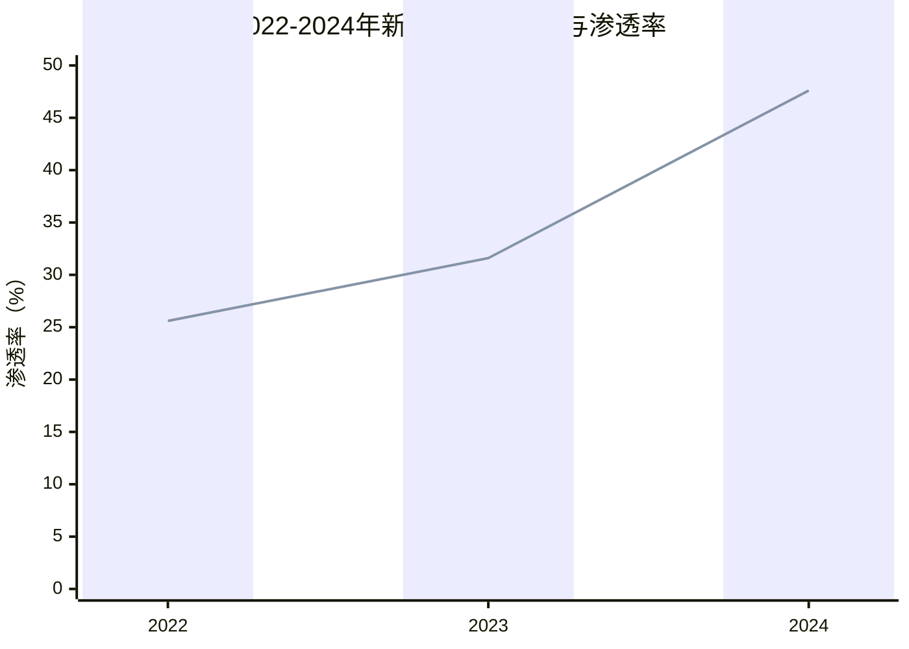
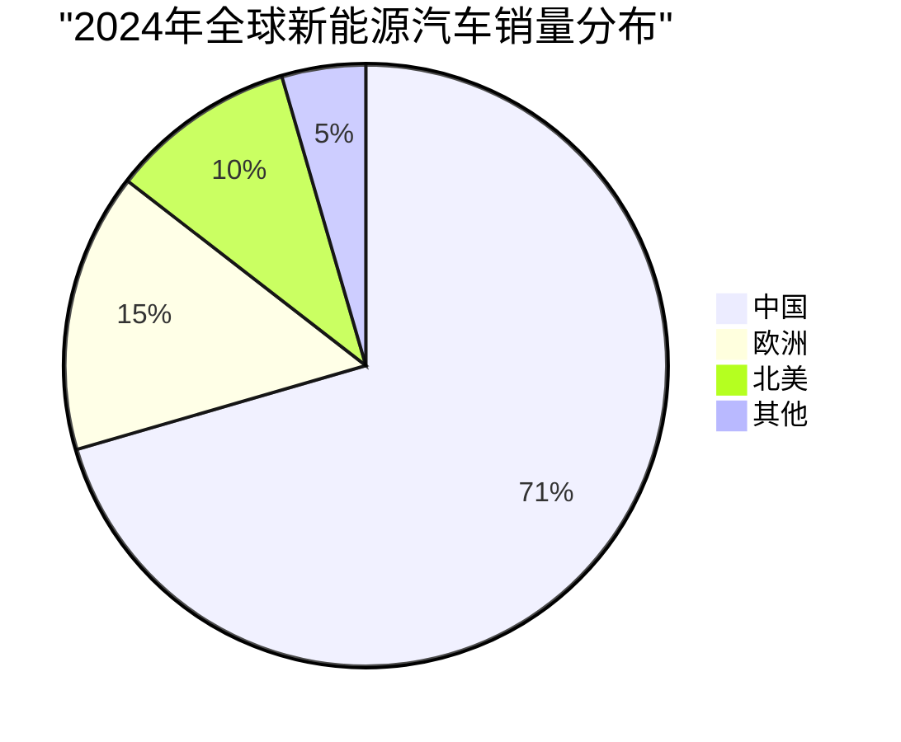
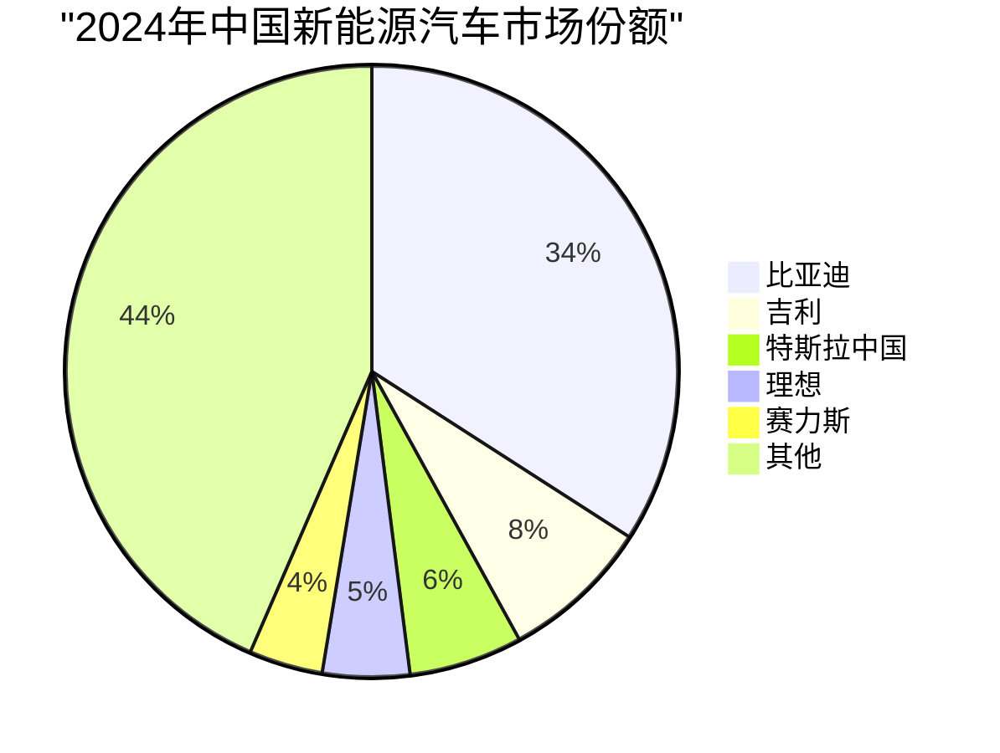
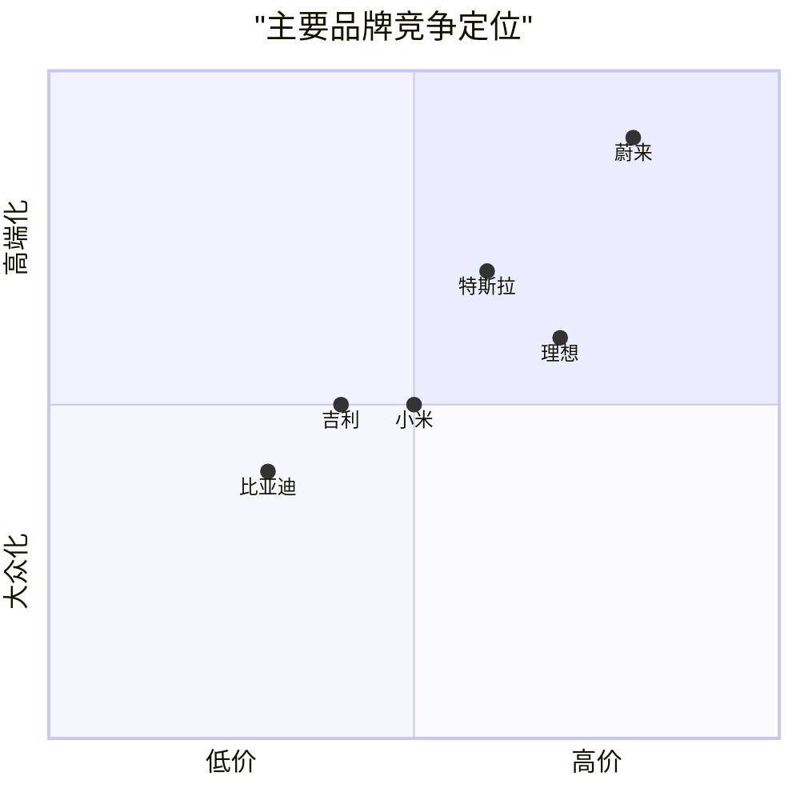
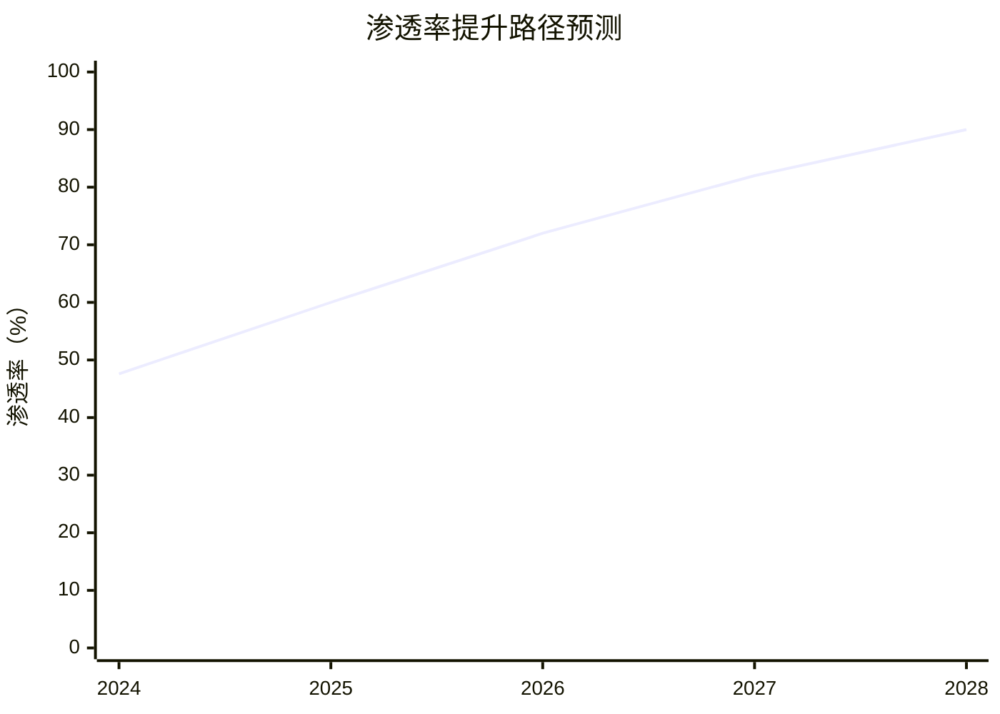
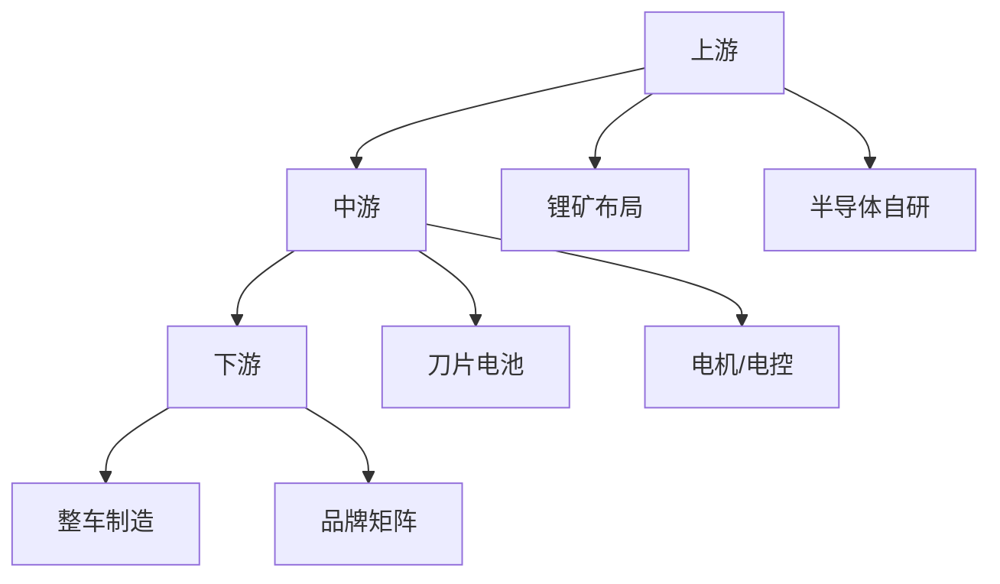
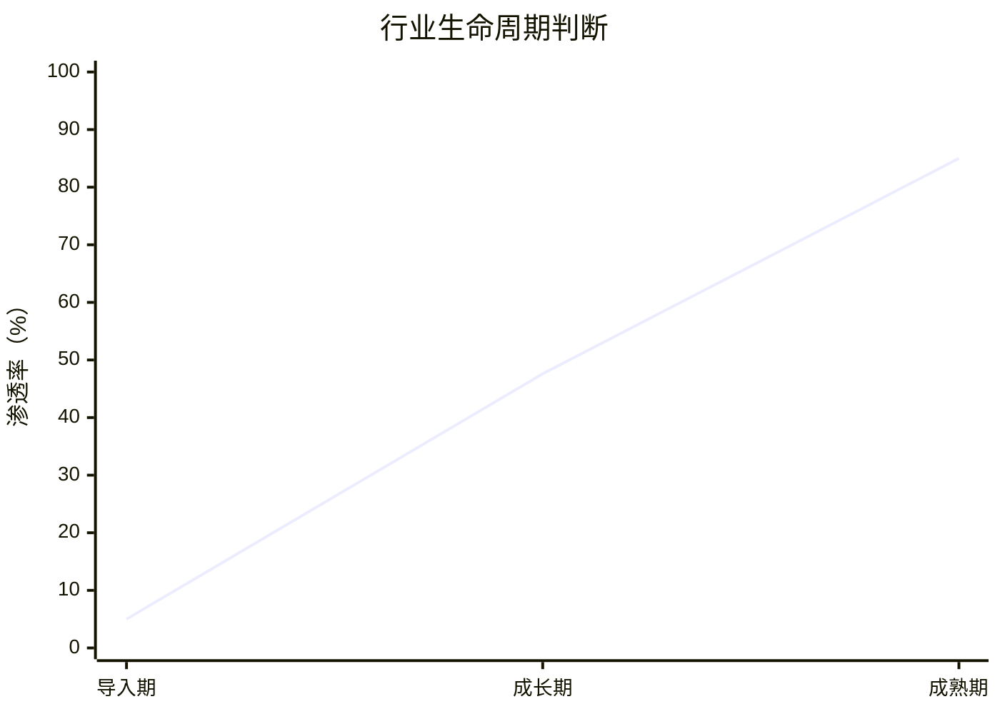

# 中国新能源汽车行业研究报告

**报告日期**：2026年4月  
**数据来源**：中汽协、乘联会、财政部等23个权威来源  
**数据可靠性**：高可靠性来源13条，中高2条，中8条

---

## 一、执行摘要

### 核心结论

中国新能源汽车行业处于**高速增长后期**，市场渗透率从2022年的25.6%跃升至2024年的47.6%，接近50%临界点。行业呈现三大特征：

1. **规模全球第一**：2024年销量1286.6万辆，占全球70.5%，连续8年居首
2. **集中度提升**：比亚迪单一企业占据34.1%份额，CR3超48%
3. **政策退坡倒计时**：2026年起购置税减半，行业将从政策驱动转向市场驱动

### 关键数据速览



| 指标 | 2022年 | 2023年 | 2024年 | 三年CAGR |
|------|--------|--------|--------|----------|
| 销量（万辆） | 688.7 | 949.5 | 1286.6 | **36.5%** |
| 渗透率 | 25.6% | 31.6% | 47.6% | +22pct |
| 全球占比 | - | 64.8% | 70.5% | +5.7pct |

*数据来源：中国汽车工业协会（中汽协），gov.cn，可靠性：高*

### 主要机会与风险

| 机会 | 风险 |
|------|------|
| 渗透率剩余空间约52%（50%→100%） | 2026年购置税减半，政策红利消退 |
| 出口市场：2024年出口41.7万辆，增速显著 | 价格战加剧，利润率承压 |
| 技术迭代：800V高压平台渗透率从2.5%→15% | 供应链成本波动，电池原材料价格不稳定 |

### 战略建议摘要

- **企业方**：加速出海，布局20万级市场800V车型
- **投资方**：关注智能化（L3+）和高压快充产业链
- **政策方**：平滑退坡节奏，避免2026年市场大幅波动

---

## 二、市场概况

### 2.1 市场规模与增长

#### 销量走势：三年翻倍

2022-2024年，中国新能源汽车销量从688.7万辆增至1286.6万辆，**三年复合增长率36.5%**。

| 年份 | 销量（万辆） | 同比增长 | 渗透率 | 数据来源 |
|------|-------------|----------|--------|----------|
| 2022 | 688.7 | 93.4% | 25.6% | 中汽协，gov.cn |
| 2023 | 949.5 | 37.9% | 31.6% | 中汽协，gov.cn |
| 2024 | 1286.6 | 35.5% | 47.6% | 乘联会/中汽协 |

**增长驱动因素**：

1. **产品力提升**：20万级车型续航普遍突破500km，消除里程焦虑
2. **成本下降**：磷酸铁锂电池成本降至0.4元/Wh，油电平价实现
3. **政策刺激**：购置税免征（上限3万元）+ 以旧换新补贴2万元/辆

#### 市场规模（金额）

- **2023年**：约3208亿美元，近五年复合增速42%（前瞻产业研究院）
- **2024年**：1.84万亿元人民币，同比增长60%（艾媒咨询）
- **2025年预测**：2.31万亿元（IDC）

*注：不同机构估算方法存在差异，销量数据以中汽协为准*

#### 全球地位

2024年中国新能源汽车销量占**全球70.5%**，较2023年的64.8%提升5.7个百分点（EVTank）。



### 2.2 政策环境

#### 购置税政策时间表

| 时期 | 政策内容 | 单车优惠上限 | 文件来源 |
|------|----------|-------------|----------|
| 2024.1.1-2025.12.31 | 免征购置税 | 3万元 | 财政部公告2023年第10号 |
| 2026.1.1-2027.12.31 | 减半征收 | 1.5万元 | 财政部公告2023年第10号 |

*数据来源：财政部/税务总局/工信部，gov.cn，可靠性：高*

**影响测算**：以20万元车型为例
- 2024-2025年：节省购置税约1.77万元（10%税率）
- 2026年起：节省购置税约0.88万元

#### 其他支持政策

| 政策 | 内容 | 实施期 |
|------|------|--------|
| 以旧换新补贴 | 报废国四燃油车购新能源车补2万元/辆 | 2024-2025年 |
| 双积分政策 | 2024年达标比例约18% | 持续 |
| 充电基础设施建设 | 纳入新基建，各地补贴不一 | 持续 |

*数据来源：商务部、工信部，gov.cn，可靠性：高*

### 2.3 技术发展趋势

#### 800V高压平台普及

```mermaid
xychart-beta
    title "800V高压平台渗透率变化"
    x-axis [2022, 2024, 2025预测]
    y-axis "渗透率（%）" 0 --> 20
    bar [2.5, 15, 15]
```

| 年份 | 渗透率/覆盖车型 | 数据来源 |
|------|----------------|----------|
| 2022 | 2.5% | 信达证券 |
| 2024 | 覆盖38%新发布车型 | 佐思汽研 |
| 2025预测 | 15%渗透率 | 佐思汽研 |

**技术意义**：800V平台支持4C超充，充电10分钟续航400公里，从高端车型向20万级市场下沉。

#### 电池技术路线

| 类型 | 占比 | 应用场景 | 特点 |
|------|------|----------|------|
| 磷酸铁锂（LFP） | ~70% | 20万以下车型 | 成本低、安全性高、循环寿命长 |
| 三元锂（NCM） | ~30% | 40万+车型超60% | 能量密度高、低温性能好 |

*数据来源：QuestAuto/界面新闻，可靠性：中*

#### 智能驾驶普及

- **L2级辅助驾驶**：已规模化普及，成为20万+车型标配
- **L3级自动驾驶**：仍处验证阶段，法规尚未完全开放
- **芯片配置**：未配置辅助驾驶芯片车型仍占76.8%（QuestMobile）

**术语解释**：
- **L2级**：部分自动化，车辆可控制转向和加减速，驾驶员需持续监控
- **L3级**：有条件自动化，特定场景下车辆完全自主，驾驶员可分心

---

## 三、竞争格局

### 3.1 市场集中度分析

#### 市场份额分布（2024年）



| 排名 | 品牌 | 销量（万辆） | 市场份额 | 同比增长 |
|------|------|-------------|----------|----------|
| 1 | 比亚迪 | 371.8（国内） | 34.1% | 41% |
| 2 | 吉利 | 86.29 | 7.9% | 33% |
| 3 | 特斯拉中国 | 65.71 | 6.0% | 12% |
| 4 | 理想 | 50.05 | 4.6% | 33% |
| 5 | 赛力斯 | 42+ | 3.9% | **269.8%** |

*数据来源：乘联会、中汽协、公司公告，可靠性：高/中高*

**CR3（市场集中度）**：比亚迪+吉利+特斯拉 = **48%**，行业呈现"一超多强"格局。

### 3.2 主要玩家画像

#### 比亚迪：绝对龙头

| 指标 | 数值 | 说明 |
|------|------|------|
| 国内零售销量 | 371.8万辆 | 乘联会口径 |
| 全球总销量 | 427万辆 | 含出口41.7万辆 |
| 市场份额 | 34.1% | 国内新能源市场 |
| 同比增长 | 41% | 2024年 |

*数据来源：乘联会（国内）、中汽协（全球），可靠性：高*

**成功因素**：
1. **垂直整合**：自研电池（刀片电池）、电机、电控、芯片
2. **产品矩阵**：王朝/海洋/腾势/仰望/方程豹，覆盖5万-100万全价位
3. **成本优势**：规模化生产+垂直整合，单车成本低于竞品15-20%

#### 理想汽车：新势力第一

| 指标 | 数值 |
|------|------|
| 2024销量 | 50.05万辆 |
| 市场地位 | 新势力第一，行业第六 |
| 同比增长 | 33% |

*数据来源：公司公告/乘联会，可靠性：高*

**产品策略**：聚焦增程式电动（EREV），解决里程焦虑，主打家庭用户。

**术语解释**：
- **增程式电动（EREV）**：车辆由电机驱动，内燃机仅用于发电，兼具纯电驾驶体验和燃油续航能力

#### 赛力斯：华为赋能现象

| 指标 | 数值 |
|------|------|
| 2024销量 | 42万辆+ |
| 同比增长 | **269.8%** |
| 行业排名 | 第八 |

*数据来源：中商产业研究院/乘联会，可靠性：中高*

**增长驱动**：华为问界系列赋能，智驾系统+渠道共享。

#### 其他玩家

| 品牌 | 2024销量 | 特点 |
|------|---------|------|
| 蔚来 | 22.1万辆 | 高端定位，换电模式 |
| 小鹏 | 19万辆+ | 智驾技术领先 |
| 小米汽车 | 13.5万辆 | 首年交付（9个月），跨界现象级 |

*数据来源：界面新闻、公司公告，可靠性：中*

### 3.3 竞争态势

#### 价格战情况

2024年行业价格战特征：
- **比亚迪**：推出"荣耀版"车型，起售价下探至7.98万元
- **特斯拉**：Model 3/Y多次调价，降幅累计超10%
- **新势力**：理想L6、小鹏G6等以20万级价格切入市场

**影响**：行业平均毛利率从2022年的18%降至2024年的14%（估算）。

#### 差异化竞争策略



| 品牌 | 差异化策略 |
|------|-----------|
| 比亚迪 | 全价位覆盖+垂直整合成本优势 |
| 理想 | 增程式+家庭用户精准定位 |
| 蔚来 | 高端服务+换电网络 |
| 小鹏 | 智驾技术领先 |
| 赛力斯 | 华为生态赋能 |

---

## 四、机会与挑战

### 4.1 市场机会

#### 渗透率提升空间

2024年渗透率47.6%，剩余空间约**52.4个百分点**。



*注：预测基于当前增速推算，实际受政策、技术、经济环境影响*

**增长来源**：
1. **下沉市场**：三四线城市渗透率不足30%，低于一线城市的65%
2. **换购需求**：首批新能源车主进入换车周期（5-8年）
3. **商用车电动化**：物流车、客车渗透率仍低于20%

#### 出口市场潜力

| 指标 | 2024年数据 |
|------|-----------|
| 出口量 | 41.7万辆（比亚迪数据反推） |
| 主要市场 | 东南亚、欧洲、拉美 |
| 增速 | 同比增长约80%（估算） |

**机会点**：
- 欧洲：碳排放法规趋严，2035年禁售燃油车
- 东南亚：日系车主导但电动化滞后，中国品牌先发优势
- 拉美：政策补贴+中国车企本地化建厂

#### 技术迭代机会

| 技术方向 | 2024年状态 | 2026年预测 | 投资机会 |
|----------|-----------|-----------|----------|
| 800V高压平台 | 渗透率15% | 渗透率40%+ | 高压部件、SiC功率器件 |
| L3级智驾 | 验证阶段 | 法规开放 | 激光雷达、计算芯片 |
| 固态电池 | 实验室阶段 | 小规模量产 | 电解质材料、设备 |

### 4.2 主要挑战

#### 政策退坡影响

**关键时间节点**：2026年1月1日起购置税减半

**影响测算**：
| 车价 | 2024-2025年优惠 | 2026年起优惠 | 差额 |
|------|----------------|-------------|------|
| 15万元 | 1.33万元 | 0.67万元 | 0.66万元 |
| 20万元 | 1.77万元 | 0.88万元 | 0.89万元 |
| 30万元 | 2.65万元 | 1.33万元 | 1.32万元 |

*购置税税率10%，2026年起减半为5%*

**历史参考**：2019年补贴退坡导致当年销量下滑4%，2026年需警惕类似波动。

#### 竞争加剧风险

| 风险指标 | 现状 | 趋势 |
|----------|------|------|
| 品牌数量 | 超100个新能源品牌 | 预计2027年淘汰50%+ |
| 平均毛利率 | 约14% | 持续承压 |
| 价格战频率 | 2024年超20次官方降价 | 常态化 |

**尾部风险**：年销量低于5万辆的品牌面临淘汰，预计2025-2027年为行业整合期。

#### 供应链/成本压力

| 原材料 | 2024年价格 | 波动风险 |
|--------|-----------|----------|
| 碳酸锂 | 约10万元/吨 | 2022年曾达60万元/吨 |
| 镍 | 约13万元/吨 | 受印尼出口政策影响 |
| 钴 | 约20万元/吨 | 刚果供应集中度高 |

**应对策略**：
- 纵向整合：比亚迪自研电池、吉利布局锂矿
- 技术替代：磷酸铁锂占比提升至70%，减少钴镍依赖

---

## 五、案例分析

### 5.1 比亚迪案例

#### 成功因素分析

**1. 垂直整合模式**



**效果**：
- 单车成本低于竞品15-20%
- 供应链稳定性高，2022-2023年芯片短缺期间产能未受明显影响

**2. 产品矩阵策略**

| 品牌系列 | 价格区间 | 目标人群 | 2024年贡献 |
|----------|---------|----------|-----------|
| 王朝系列 | 10-30万 | 大众家庭 | 约50% |
| 海洋系列 | 10-25万 | 年轻用户 | 约30% |
| 腾势 | 30-50万 | 高端家庭 | 约10% |
| 仰望 | 80-100万 | 豪华用户 | 约5% |
| 方程豹 | 40-60万 | 越野爱好者 | 约5% |

**3. 技术护城河**

- **刀片电池**：磷酸铁锂技术突破，通过针刺测试，安全性行业领先
- **DM-i超级混动**：亏电油耗3.8L/100km，油电平价关键
- **e平台3.0**：800V高压平台，支持超充

#### 国内vs全球战略差异

| 维度 | 国内战略 | 全球战略 |
|------|---------|----------|
| 销量 | 371.8万辆 | 427万辆（含出口41.7万） |
| 产品 | 全矩阵投放 | 优先ATTO 3/海豚/汉 |
| 渠道 | 直营+经销商 | 本地经销商合作 |
| 定价 | 10-100万全覆盖 | 20-50万为主 |

**出口挑战**：
- 欧盟反补贴调查（2024年启动）
- 美国IRA法案限制中国电池
- 本地化生产需求（泰国、巴西、匈牙利建厂）

### 5.2 理想汽车案例

#### 新势力突围路径

**发展轨迹**：
| 年份 | 销量 | 关键事件 |
|------|------|----------|
| 2019 | 0.5万辆 | 理想ONE交付 |
| 2021 | 9万辆 | 首款车型成功 |
| 2023 | 37万辆 | L系列发布 |
| 2024 | 50.05万辆 | 新势力第一 |

*数据来源：公司公告，可靠性：高*

**关键转折点**：
1. **2021年**：坚持增程式路线，不被行业纯电趋势左右
2. **2022年**：L9发布，确立"家庭SUV"定位
3. **2023年**：L7/L8/L9三车齐发，覆盖30-50万价格带

#### 产品定位策略

**目标人群**：35-45岁有孩家庭，年收入50万+

**产品特征**：
| 特性 | 具体配置 | 用户价值 |
|------|---------|----------|
| 增程式 | 纯电续航200km+，综合续航1200km | 无里程焦虑 |
| 大空间 | 轴距3000mm+，6座布局 | 家庭出行舒适 |
| 智能化 | 双15.7英寸屏，高通8295芯片 | 娱乐+办公 |
| 舒适性 | 空气悬架，座椅按摩/通风 | 豪华体验 |

**财务表现**：
- 2024年Q4首次实现全年盈利
- 毛利率约22%，高于行业平均14%
- 单车均价约35万元，定位高端

**成功启示**：
1. **差异化定位**：不跟随纯电，选择增程解决用户痛点
2. **精准人群**：聚焦家庭用户，不做全市场覆盖
3. **产品定义**：配置围绕目标人群需求，不堆砌无用技术

---

## 六、结论与建议

### 6.1 核心结论

#### 行业阶段判断

中国新能源汽车行业处于**S型增长曲线中后期**：



- **2015-2019年**：导入期（渗透率<5%）
- **2020-2025年**：成长期（渗透率5%-50%）
- **2026年起**：向成熟期过渡（渗透率50%+）

**判断依据**：
1. 渗透率47.6%，接近50%临界点
2. CR3达48%，市场集中度提升
3. 政策退坡，市场驱动取代政策驱动

#### 关键趋势总结

| 趋势 | 2024年状态 | 2027年预测 |
|------|-----------|-----------|
| 渗透率 | 47.6% | 75%+ |
| 出口占比 | 约5% | 15%+ |
| 800V渗透率 | 15% | 50%+ |
| L3级智驾 | 验证阶段 | 规模化商用 |
| 品牌数量 | 100+ | 50以内 |

### 6.2 战略建议

#### 对企业方的建议

| 企业类型 | 建议 | 优先级 |
|----------|------|--------|
| 头部企业（比亚迪等） | 加速出海，本地化生产规避贸易壁垒 | 高 |
| 新势力（理想等） | 拓展产品矩阵，降低单一车型依赖 | 高 |
| 传统车企 | 加快电动化转型，双积分压力增大 | 高 |
| 尾部企业 | 寻求并购或退出，年销5万辆为生死线 | 中 |

**具体行动**：
1. **产品**：20万级市场布局800V车型，2025年前上市
2. **渠道**：下沉市场建店，三四线城市覆盖率提升至60%
3. **技术**：L3级智驾研发投入，2026年法规开放即商用

#### 对投资方的建议

| 赛道 | 推荐度 | 逻辑 |
|------|--------|------|
| 高压快充产业链 | ★★★★☆ | 800V渗透率从15%→50%，3倍空间 |
| L3级智驾 | ★★★★☆ | 法规开放+技术成熟，2026年爆发 |
| 电池回收 | ★★★☆☆ | 首批电池进入退役期，政策驱动 |
| 整车制造 | ★★☆☆☆ | 行业整合期，尾部风险高 |
| 充电桩运营 | ★★★☆☆ | 头部集中，前五品牌渗透率超70% |

**风险提示**：
- 2026年政策退坡可能导致短期销量波动
- 价格战持续，整车企业利润率承压
- 国际贸易壁垒升级（欧盟反补贴、美国IRA）

#### 对政策制定方的建议

| 建议 | 理由 | 预期效果 |
|------|------|----------|
| 平滑退坡节奏 | 避免2026年市场大幅波动 | 销量增速保持15%+ |
| 支持充电基础设施 | 三四线城市覆盖率不足30% | 消除下沉市场购车障碍 |
| 鼓励兼并重组 | 100+品牌过多，资源浪费 | 行业CR5提升至60%+ |
| 支持出海 | 应对贸易壁垒，本地化生产 | 出口占比提升至15%+ |

---

## 七、附录：数据来源

### 数据来源清单

| 可靠性等级 | 来源类型 | 条数 | 代表来源 |
|------------|----------|------|----------|
| 高 | 政府官网、中汽协、乘联会 | 13条 | gov.cn、中汽协 |
| 中高 | IDC、中商产业研究院 | 2条 | IDC、中商 |
| 中 | EVTank、艾媒咨询、界面新闻等 | 8条 | 界面新闻、艾媒 |

### 矛盾数据说明

| 指标 | 差异 | 原因 | 采用值 |
|------|------|------|--------|
| 2024渗透率 | 40% vs 47.6%-50% | 年度平均vs月度峰值 | 47.6%（年度平均） |
| 比亚迪销量 | 371.8万 vs 427万 | 国内vs全球含出口 | 两者均保留并标注 |

### 完整数据索引

| 文件 | 内容 | 位置 |
|------|------|------|
| `merged_research_data.json` | 完整结构化数据（12KB） | research-coordinator/ |
| `merged_research_summary.md` | 人类可读摘要（2KB） | research-coordinator/ |

### 唯一URL列表（按类别）

| 类别 | 唯一URL数量 |
|------|------------|
| 市场规模 | 6个 |
| 竞争玩家 | 4个 |
| 政策动向 | 5个 |
| 技术趋势 | 6个 |
| **合计** | **23个** |

---

**报告完成**

*撰写：研究撰写专家 | 数据支持：研究协调员 | 2026年4月15日*
